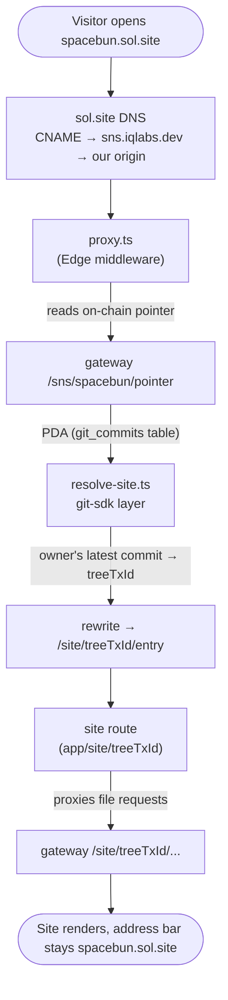
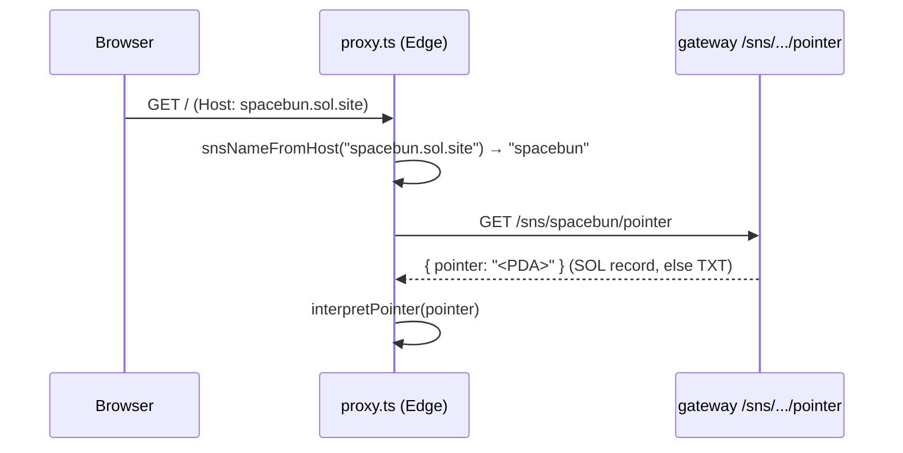
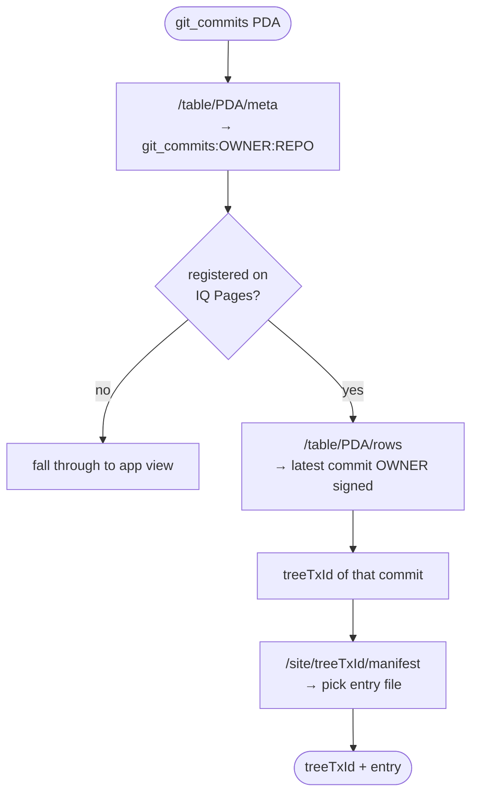
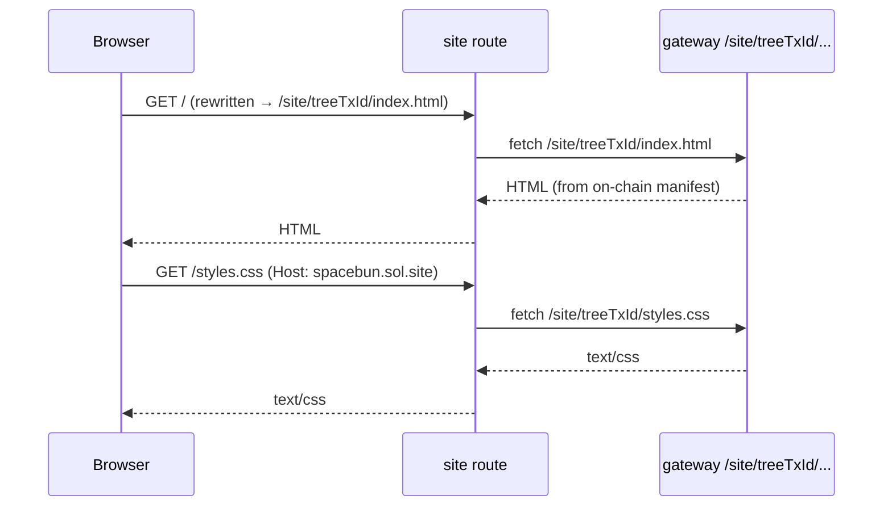
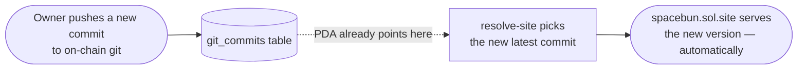
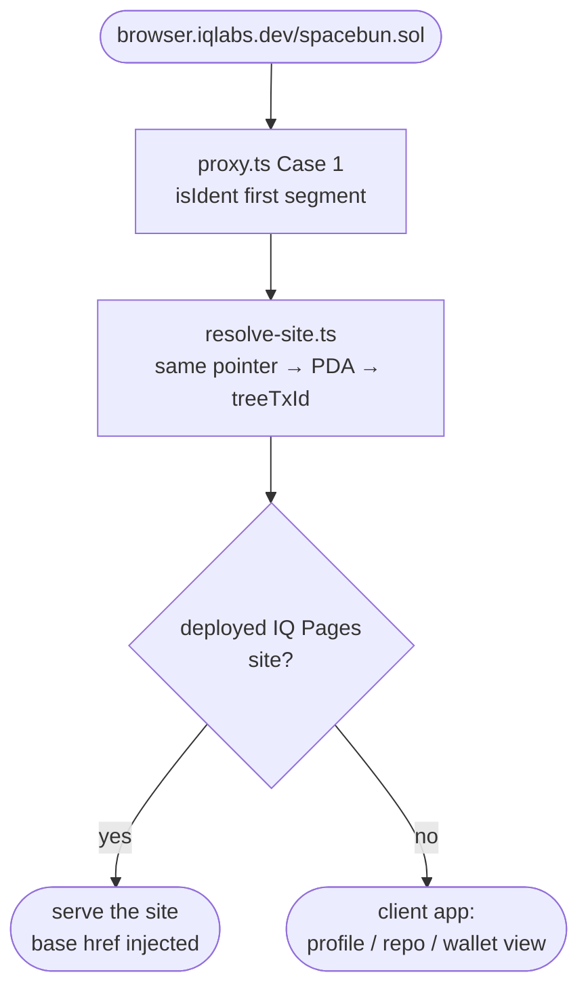

# How it works: what happens when we hit `spacebun.sol.site`

This doc traces a single request — `https://spacebun.sol.site/` — end to end:
from the moment traffic reaches our edge, through reading the on-chain pointer,
resolving the live site via the IQ git layer, and serving the files from the
gateway.

> Companion read: the gateway side of SNS resolution (records, `*.sol.site`
> host-routing, TLS) lives in the IQ Gateway repo's
> [`HOW-IT-WORKS.md`](https://github.com/IQCoreTeam/iq-gateway/blob/main/HOW-IT-WORKS.md).
> This doc is the **browser/wide-web** side.

## The big picture



The visitor never leaves `spacebun.sol.site`. Everything below happens
server-side before a single byte of the page is painted.

---

## 1. Traffic arrives → `proxy.ts` reads the on-chain pointer

`spacebun.sol` set a CNAME so sol.site routes the request into our origin. The
request arrives with `Host: spacebun.sol.site`. Our Edge middleware
([`src/proxy.ts`](src/proxy.ts)) sees that the host is a wrapping SNS domain
(not one of ours) and, **before** rendering our own app, asks the gateway what
that domain points at on-chain.



```ts
// proxy.ts — host-routing branch
const wrapName = snsNameFromHost(req.headers.get("host") ?? ""); // "spacebun"
if (wrapName) {
  const pointer = await fetchPointer(wrapName); // gateway /sns/<name>/pointer
  if (pointer) {
    const record = interpretPointer(pointer);
    ...
  }
}
```

**What's a "pointer"?** The gateway reads the domain's on-chain records in a
fixed order — the **SOL record first, then TXT** — and returns whichever is set.
The owner stores their site's identifier there.

**The default identifier is an on-chain-git PDA** — the `git_commits` table PDA
for a repo (`git_commits:OWNER:REPO`). That's the canonical case. Other shapes
(`/site/<sig>` URLs, bare tx signatures) are accepted too, but only as **legacy
support**; new sites point at a git PDA.

```ts
// interpretPointer: PDA → dispatcher; /site URL or tx sig → direct manifest
function interpretPointer(url) {
  const m = url.match(SITE_URL_RE);            // legacy: /site/<sig>/<file>
  if (m) return { kind: "site", sig: m[1], entry: m[2] || "" };
  const target = recordTarget(url);            // strip any host/scheme prefix
  if (TX_SIG_RE.test(target)) return { kind: "site", sig: target, entry: "" }; // legacy
  return { kind: "ident", ident: target };     // default: the git PDA
}
```

---

## 2. PDA → live site, via the IQ git SDK

Now we have the git PDA. The next step turns it into **the files of the repo's
latest commit** — handled by
[`src/lib/iqpages/resolve-site.ts`](src/lib/iqpages/resolve-site.ts), which sits
on top of our git-sdk / gateway reads.



```ts
// resolve-site.ts (abridged)
const meta = await gwJson(`/table/${pubkey}/meta`);      // git_commits:OWNER:REPO
if (!meta.name.startsWith("git_commits:")) return null;
const [, owner, repo] = meta.name.split(":");

// is this repo deployed on IQ Pages?
const deployed = await gwJson(`/table/${DEPLOYED_TABLE_PDA}/rows?limit=1000`);
if (!deployed.rows.some(r => r.id === `${owner}:${repo}`)) return null;

// serve the LATEST commit the repo owner actually signed
const commits = await gwJson(`/table/${pubkey}/rows?limit=${COMMIT_SCAN_LIMIT}`);
const treeTxId = latestOwnerCommit(commits.rows, owner);
const entry    = await pickEntry(treeTxId);               // manifest's index file
return { treeTxId, entry };
```

The key property: we resolve the **owner's latest signed commit every time**. So
the PDA is a stable pointer — the owner just pushes new commits to on-chain git,
and the live site follows automatically. **No re-registration, no DNS change, no
redeploy.** The PDA in the SNS record never has to change.

proxy.ts then rewrites the request to the resolved `/site/<treeTxId>/<entry>`:

```ts
const resolved = await cachedResolve(record.ident); // resolve-site.ts, cached
if (resolved) {
  const dest = req.nextUrl.clone();
  dest.pathname = `/site/${resolved.treeTxId}/${subPath || resolved.entry}`;
  return NextResponse.rewrite(dest); // internal — address bar stays spacebun.sol.site
}
```

---

## 3. Serving the files: the site route proxies the gateway

The rewrite lands on our catch-all site route
([`src/app/site/[treeTxId]/[[...path]]/route.ts`](src/app/site/[treeTxId]/[[...path]]/route.ts)).
Its only job is to **replay the gateway's `/site/<treeTxId>/...` response** —
HTML, CSS, JS, images, media. Because the page believes it lives at the root of
`spacebun.sol.site`, its own relative URLs (`styles.css`, `assets/x.png`) come
back here on the same host and get proxied too.



```ts
// site route — replay the gateway, passing through caching/range headers
const upstreamUrl = `${GATEWAY_URL}/site/${treeTxId}/${tail}`;
const upstream = await fetch(upstreamUrl, { headers: fwd });
return new NextResponse(upstream.body, { status: upstream.status, headers });
```

Under host-routing every asset request re-enters `proxy.ts` with the same
`Host`, so it re-resolves and proxies — which is why **no `<base href>` is
injected** for `*.sol.site` (that's only for the path-based form below).

---

## Why this is cheap and self-updating



- **We only have to get IQ Pages deploy right once.** After that the gateway
  serves files straight from on-chain data — we don't host or babysit anyone's
  site, so there's no per-site server cost.
- **The user only ever pushes to on-chain git.** The SNS record points at the
  git PDA, and we always read the owner's latest signed commit — so the live
  site updates itself on every push. The PDA never changes.

---

## Bonus: `browser.iqlabs.dev/spacebun.sol` (the path-based form)

Same resolution, different entry point. Instead of a wrapping host, the `.sol`
name is the **first path segment**. `proxy.ts` Case 1 handles it, and it runs
through the **same `resolve-site.ts`** as host-routing.



The split is intentional and uses **one resolver** for both outcomes:

- **Has a deployed page** → the site is served (rewritten into the site route,
  with `<base href="/spacebun.sol/">` so relative assets resolve under the path).
- **No page** → it falls through to the client app, which classifies the same
  resolved target and renders the right view — a **profile** for a wallet, a repo
  view for a git table, etc. (see [`src/resolver/use-resolve.ts`](src/resolver/use-resolve.ts)).

So a `.sol` with a deployed site shows the site, and the very same `.sol` without
one shows its profile — resolved by the same code path, just a different leaf.
